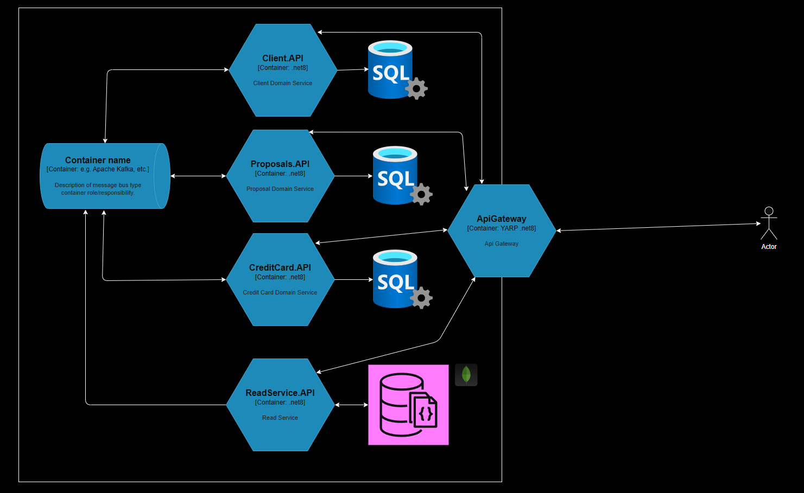
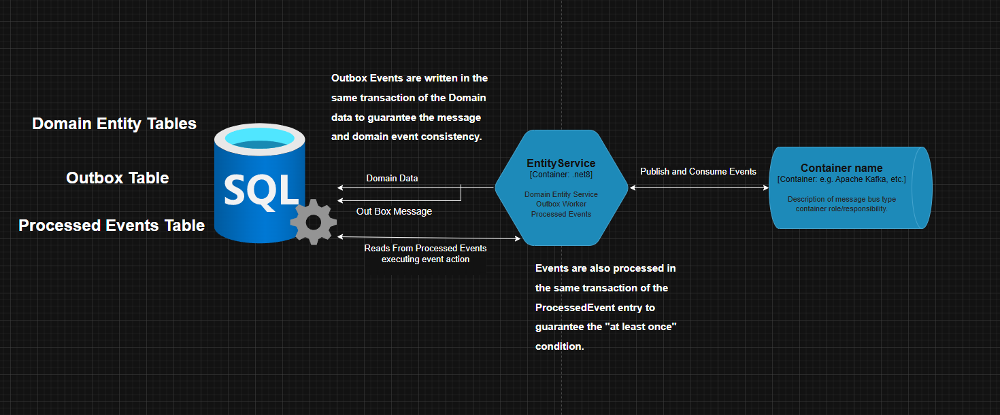

# PBanco
## Visão Geral

PBanco é uma solução .NET (C#) que utiliza arquitetura de microsserviços, sendo: um projeto API Gateway, três de 
domínio(Clients, Proposals e CreditCards), um projeto BuildingBlocks com implementações reutilizaveis, 
 um serviço dedicado para buscas e manutenção do banco de leitura e RabbitMQ para mensageria. Os serviços são orquestrados via Docker Compose.

## Requisitos da Proposta

Projeto realizado para atender os seguintes requisitos:

```
Objetivo:

Cadastrar um novo cliente via API e comunicar por mensageria:

1- Geração de proposta de crédito; 
2- Emissão de 1 ou mais cartões de crédito; 

Pensando que podem haver falhas de comunicação na proposta de crédito ou na emissão do cartão, deverá existir um processo de resiliência e sinalização via evento ao microsserviço de clientes. 

Microsserviços:

1- Cadastro de clientes; 
2- Proposta de crédito; 
3- Cartão de crédito; 
```

## Regras definidas a partir da proposta

- **Cadastro de clientes**:
  - Nome, CPF, Data de Nascimento
  - Validação de CPF (formato e unicidade)
  - Validação de idade (maior que 18 anos)  

- **Cartão de crédito**:
  - Requisitado por cliente valido
  - Quatro bandeiras (Visa, MasterCard, Elo e Amex)
  - Começa no estado "Aguardando Aprovação"(PendingApproval)
  - Requisição do cartão gera evento de cartão solicitado
  - Quando a proposta de crédito é aprovada, o cartão passa para o estado "Inativo"(Inactive), que aguarda ação do cliente para ativação
  - O número do cartão é gerado aleatoriamente no momento que a proposta é aprovada
  - O cliente pode ativar o cartão, passando para o estado "Ativo"(Active)
  - O cliente pode bloquear o cartão, passando para o estado "Bloqueado"(Blocked)
  - O cliente pode desbloquear o cartão, voltando para o estado "Ativo"(Active)
  - O cliente pode cancelar o cartão, passando para o estado "Cancelado"(Cancelled)
  - Um cliente pode ter mais de um cartão
  - Quando cliente é cancelado seus cartões também são cancelados


    
- **Proposta de crédito**:
  - Requisitado por cliente valido
  - Status: Aprovada, Rejeitada, Pendente
  - Começa no estado "Pendente"(Pending)
  - A partir do Pendente, a proposta pode ser "Aprovada"(Approved) ou "Rejeitada"(Rejected)
  - O valor da proposta é definido na aprovação
  - Quando a proposta é aprovada, o cartão passa para o estado "Inativo"(Inactive)
  - Quando a proposta é rejeitada, o cartão passa para o estado "Cancelado"(Cancelled)
  - Proposta aprovada ou rejeitada não pode ser alterada
  - Uma proposta pode ser utilizada para solicitar apenas um cartão
  
## Eventos

 - **Cliente**:
   - ClientCreatedEvent / ClientCriado : Emitido quando um cliente é criado.
   - ClientCancelledEvent / ClientCancelado : Emitido quando um cliente é cancelado.
   - ClientePropagateEvent / PropagarCliente : Emitido para propagar o estado do cliente para outros serviços.


 - **Proposta**:
   - ProposalCreatedEvent / ProposalCriada : Emitido quando uma proposta é criada.
   - ProposalApprovedEvent / ProposalAprovada : Emitido quando uma proposta é aprovada.
   - ProposalRejectedEvent / ProposalRejeitada : Emitido quando uma proposta é rejeitada.
   - ProposalPropagateEvent / PropagarProposta : Emitido para propagar o estado da proposta para outros serviços.


- **CreditCard**:
   - CreditCardRequestedEvent / CartaoSolicitado : Emitido quando um cartão é solicitado.
   - CreditCardActivatedEvent / CartaoAtivado : Emitido quando um cartão é ativado.
   - CreditCardIssuedEvent / CartaoEmitido : Emitido quando um cartão é emitido (aprovado).
   - CreditCardBlockedEvent / CartaoBloqueado : Emitido quando um cartão é bloqueado.   
   - CreditCardCancelledEvent / CartaoCancelado : Emitido quando um cartão é cancelado.
   - CreditCardPropagateEvent / PropagarCartao : Emitido para propagar o estado do cartão para outros serviços.

## Principais Componentes



### API Gateway
Projeto dotnet utilizando YARP como proxy para fazer o roteamento das requisições de leitura para o serviço de leitura e as requisições de escrita para os serviços de domínio.

- Path: 
  - src/Services/ApiGateway/ApiGateway/  

### BuildingBlocks (bibliotecas compartilhadas)

 - Contém implementações para:

    - **CQRS/Mediatr**: Interfaces e classes base para Commands, Queries e Handlers.

   - **Domain**: Entidades base, eventos, execções, interfaces de repositórios genéricos.   

   - **Outbox** : Implementação do padrão Outbox para garantir a consistência entre o banco de dados e o sistema de mensageria.

   - **ProcessedEvents** : Implementação de tabela ProcessedEvents/Inbox para evitar o processamento duplicado de eventos.

   - **UnitOfWork** : Implementação do padrão Unit of Work para auxiliar na atomicidade das transações da Outbox e Inbox.

   - **Behaviors** : Implementações do comportamento de validação para os Handlers do Mediatr.

- Path:
  - src/BuildingBlocks/BuildingBlocks/

### Serviços de Domínio

Contém as regras de negócio, persistência de dados, camada de aplicação, integração do padrão OutBox e Inbox juntamente com comunicação via eventos com RabbitMQ via MassTransit.

 - Path: 
   - src/Services/Clients/Clients.API
   - src/Services/CreditCard/CreditCard.API
   - src/Services/Proposal/Proposal.API



### ReadService

Serviço dedicado para consultas, responsável por manter o banco de leitura atualizado através do consumo dos eventos publicados pelos serviços de domínio.

 - Path:
   - src/ReadService/ReadService.API

### Gerenciadores de Banco de Dados

 - **SQL Server**: Cada serviço de domínio e possui um banco dedicado com suas respectivas tabelas de inbox e outbox. Interação e versionamento feito via Entity Framework Core.
 - **MongoDB**: Utilizado pelo serviço de leitura para armazenar os dados de consulta. Interação feita via MongoDB.Driver.

### Orquestração (Docker Compose)

Todos os serviços são orquestrados utilizando Dockerfile e Docker Compose.

- Path
  - src/Services/ApiGateway/ApiGateway/Dockerfile
  - src/Services/Clients/Clients.API/Dockerfile
  - src/Services/CreditCard/CreditCard.API/Dockerfile
  - src/Services/Proposal/Proposal.API/Dockerfile
  - src/Services/ReadService/ReadService.API/Dockerfile
  - src/compose.yaml

## Para Rodar o Projeto

Utilizar o arquivo compose.yaml na pasta /src do projeto
